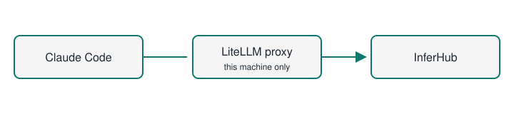

# claude-code-launcher

Double-click one file and Claude Code opens in your project, with every request
going through a LiteLLM proxy on your own machine to InferHub. This repository
holds that launcher for **Windows** and **Mac**, and the proxy files both of
them run.

Before this repository, the launcher lived in three places that had drifted
apart: a Desktop copy on the PC, a module in agent-custom-setup, and the
`litellm-ckff-ops` workbench it needed cloned next to it. Now one checkout is
enough.



## Start it

**Windows.** Clone this repository, then double-click
`windows\launch-claude-inferhub.cmd`. Pick the main model, the advisor (or OFF)
and a project folder with the arrow keys. The first run makes the Python venv
under `shared\litellm\.litellm-venv` with uv (or with `python -m venv` and
pip if uv is not installed); Claude Code and either uv or Python must already
be installed.

**Mac.** Clone this repository, then double-click
`mac/Launch Claude InferHub.command`, or run `mac/setup.sh` once and use the
`claude-acs` command after that. The first run installs what is missing and asks
once for your InferHub key. Folders can be picked from a list, browsed with the
arrow keys in the terminal, or typed. See [mac/README.md](mac/README.md).
**The Mac launcher has only been tested on Linux so far.**

Both launchers default to DeepSeek V4.1 Flash with the advisor OFF, and start
Claude Code with `claude --model sonnet --permission-mode bypassPermissions`.
The model list is the IRE Top 20, fetched at start-up by `shared/ire/` (see
below).

## Non-interactive mode (for other tools)

Some tools start Claude Code themselves, for example
[Paseo](https://github.com/getpaseo/paseo) on a phone. They can still go through
the local LiteLLM with the same seats, aliases and fallback chains. Non-interactive
mode shows no menus and never prompts. It also never starts, restarts or reloads
the proxy: the proxy keeps the seat from the last interactive launch, and if the
proxy is down the command stops with exit code 3.

```powershell
# Windows: print the variables, or run claude with them
.\windows\launch-claude-inferhub.ps1 -NonInteractive -PrintEnv json
.\windows\launch-claude-inferhub.ps1 -NonInteractive -Folder D:\development\app -- -p "hello"
```

```bash
# Mac
"mac/Launch Claude InferHub.command" --non-interactive --print-env dotenv
"mac/Launch Claude InferHub.command" --non-interactive -- -p "hello"
```

Both launchers accept `--non-interactive`, `--print-env json|dotenv` and
`--folder DIR`. Windows also takes the `-NonInteractive`, `-PrintEnv` and
`-Folder` spellings. The `CCL_NONINTERACTIVE=1` and `CCL_PRINT_ENV=json`
environment variables do the same thing. Launcher options go first, and `--`
ends them. The JSON output has four parts:

- `set`: the variables Claude Code gets, the same ones an interactive launch
  sets (base URL, auth, `sonnet` seat, `small-fast`, the four tier pins and
  `CLAUDE_CODE_WORKFLOWS`)
- `unset`: names to clear first
- `unset_prefixes`: prefixes whose leftover variables should be cleared too
- `info`: the seat, where it was read from, whether the proxy is healthy and
  which auth is used

`last-picks.json` is only reported. To change the seat, run the launcher
interactively.

Passing arguments that contain double quotes (JSON) through Windows PowerShell
5.1 loses the quotes. For tools that do that, use
`node shared/integrations/claude-env-exec.mjs [claude args...]`. It reads the
JSON, applies it and starts claude with the arguments exactly as given. It keeps
the `CLAUDE_CODE_*` control variables an SDK host sets, skips the launcher for
`--version` and `auth` probes, and passes claude's exit code back. Set
`CCL_CLAUDE_BIN` to choose the claude executable. It also turns
`--permission-mode default` (which Paseo sends when it resumes a session that
started in default mode) into `--permission-mode auto`; set
`CCL_KEEP_DEFAULT_PERMISSION_MODE=1` to keep default. Other modes pass through.

## Keys

Copy `.env.example` to `.env` in the repository root and fill in
`INFERHUB_API_KEY`. That is the only key you need on a Mac. On the PC the
launcher also reads `configs\.env` on your Desktop for the CKFF keys (the first
that exists of the Desktop known folder, `%USERPROFILE%\Desktop` and
`%OneDrive%\Desktop`), and takes the InferHub key from the first of these that
exists: the IRE `.env` in `inference-recommendation-engine` next to this
repository or under `D:\development`, this repository's `.env`,
`~\.config\inferhub\.env`.

**There is no proxy key.** The proxy runs without a `LITELLM_MASTER_KEY` and
listens on 127.0.0.1 only, so nothing outside the machine can reach it. Claude
Code still insists on some API key, so the launchers give it the dummy value
`local`. If you do set `LITELLM_MASTER_KEY` in one of the env files, the proxy
enforces it and the launchers pass it to Claude Code instead.

Only `.env.example` is tracked. `.env` is gitignored.

## How a request is routed

Claude Code only knows Anthropic model names. The proxy maps them to the two
InferHub seats you picked:

| Claude Code asks for | Goes to |
| --- | --- |
| `sonnet`, `main`, `claude-sonnet-5` | the main seat |
| `opus`, `advisor`, `claude-opus-5-5`, `claude-fable-5` | the advisor seat, or main when the advisor is OFF |
| `haiku`, `small-fast`, `claude-haiku-5`, `claude-haiku-4-5-20251001` | the fast seat, `cb/deepseek-v4.1-flash` unless the seat file says otherwise, with its own fallback chain ending on `ali/qwen3.8-flash`. Both launchers point Claude Code's small, fast requests here. |
| `ih/<model id>` | that InferHub model directly |

If a seat fails, the proxy falls back along the chains in
`shared/litellm/config/inferhub_fallbacks.yaml`. Changing seats later
hot-reloads the running proxy; it does not restart it.

## Where the model list comes from

`shared/ire/ire_fetch.py` reads the IRE Top 20 from the private
`inference-recommendation-engine` repository each time a launcher starts. It
signs in with `GH_TOKEN`, `GITHUB_TOKEN` or `gh auth token`. If that fails, it
uses the last list it fetched, and if there is none yet, a built-in list. It
never stops a launch. The Mac launcher shows the fetched list in its picker;
Windows still shows its built-in table and passes the fetched one on as
`CCL_IRE_JSON`.

It also reads IRE's newer frontier list (stronger models with live route
prices, IRE PR #68) when it's there, and keeps it in the same answer. Both
pickers can seat from it: `f` at the Mac prompts, Tab on Windows. A `cx/` seat
goes through the proxy's Responses mode (`/v1/responses`), which is what those
routes ask for.

## What is where

| Folder | What it holds |
| --- | --- |
| `windows/` | The PowerShell launcher, and `litellm/` with the start and stop scripts |
| `mac/` | The Mac launcher, `setup.sh` (installs it and the `claude-acs` command), `stop-litellm.sh`, the folder navigation in `lib/`, and its tests |
| `shared/litellm/` | Proxy config, seat and merge scripts, fallback chains, pinned requirements |
| `shared/ire/` | The IRE fetch, its cache rules and its built-in defaults |
| `shared/integrations/` | `claude-env-exec.mjs`, which runs claude with the non-interactive launcher env for other tools |
| `docs/` | [PARITY.md](docs/PARITY.md) compares the two launchers; [HOOKS.md](docs/HOOKS.md) lists where planned features plug in |
| `history/` | Older launcher versions, kept as a record |
| `SOURCES.md` | Where every copied file came from, with commit and hash |

## Boundaries

- **Port 4000 is the live proxy.** Tests use other ports, and
  `stop-litellm.ps1` stops only the process `start-litellm.ps1` recorded in
  `shared/litellm/logs/litellm.pid`, never whatever happens to hold the port.
- If a proxy started from the old `litellm-ckff-ops` checkout is still running
  on 4000, the launchers reuse it. It reads its own config files, so seat
  changes made from this repository do not reach it. Stop that one by hand once
  and let the launcher start its own.
- The routing scripts are copied from `litellm-ckff-ops` unchanged (now at
  `de69e68`). Changing them needs its own issue.

## Status

| Check | State |
| --- | --- |
| Windows launcher | Taken from the PC on 2026-10-03, with small path and key edits listed in `SOURCES.md`. Linted in CI; the edits have not been run on Windows yet. |
| Mac launcher | Unit tests and the dry run (installer, `claude-acs`, launcher) pass on Linux under bash 5 and bash 3.2.57. Not yet run on a Mac. |
| CI | `gates` (stack validators), `lint`, `mac-dry-run`, `bash 3.2 compatibility` and `python-tests` are required on every pull request. |
